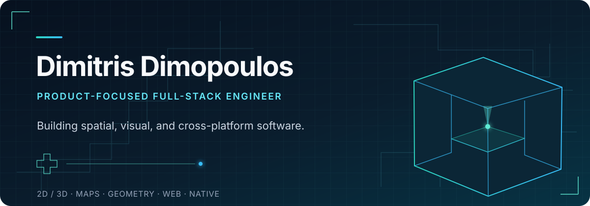

<div align="center">
  <a href="https://github.com/jimmy123A">
    
  </a>
</div>

<br />

## Hello — I'm Dimitris.

I build products where **software meets physical space**: interactive floor plans,
3D scenes, mapping tools, native capture experiences, and the systems that make
them useful in real workflows.

My work is product-focused and full-stack. I move between interface design,
geometry and rendering, APIs, cloud services, payments, mobile, and desktop —
with most of that work centered on the **[Planpoint](https://planpoint.io)**
ecosystem.

---

## The Planpoint ecosystem

Planpoint is a connected family of spatial products. I work across the surfaces
that turn architectural information into experiences people can explore, edit,
share, and act on.

<table>
  <tr>
    <td width="50%" valign="top">
      <h3>Viewer</h3>
      <p>
        A full-stack platform for interactive 2D and 3D floor plans:
        geospatial tools, rich spatial editing, media workflows, embeds,
        SDK/API surfaces, and payments.
      </p>
      <sub>Next.js · React · Three.js · Mapbox · Konva/SVG · MongoDB · GCS · Stripe · OpenAPI</sub>
    </td>
    <td width="50%" valign="top">
      <h3>Visit</h3>
      <p>
        Interactive 360° real-estate tours for photographers and brokers,
        supported by a web dashboard, image delivery, galleries, hotspots,
        authentication, and cloud storage.
      </p>
      <sub>Web applications · 360° media · Auth · Cloud storage</sub>
    </td>
  </tr>
  <tr>
    <td width="50%" valign="top">
      <h3>Architect</h3>
      <p>
        AI-assisted drawing-set extraction with source-linked review, 2D
        floorplan generation, 3D illustrations, geometry validation, and
        PDF/Excel exports.
      </p>
      <sub>Next.js · TypeScript · Durable workers · Three.js · PDF tooling · Pathfinding</sub>
    </td>
    <td width="50%" valign="top">
      <h3>CX</h3>
      <p>
        Interactive spatial customer experiences combining 3D, XR/AR,
        routing and navigation, spatial integrations, and commerce workflows.
      </p>
      <sub>3D/XR/AR · Navigation · Integrations · Commerce</sub>
    </td>
  </tr>
</table>

### Across devices and workflows

- **Floorplan Scanner for iOS** — native Swift/SwiftUI capture with Apple
  RoomPlan and LiDAR, USDZ output, 3D/AR preview, and Visit authentication.
- **Viewer Mobile** — a React Native and Expo client for Planpoint experiences.
- **Superframe** — cross-platform Windows and macOS surfaces spanning React
  Native and native platform work.
- **Lobby** — a customer-facing Next.js product surface.
- **Integrations** — Planpoint automation and embedded workflows through
  Zapier and Wix.
- **Documentation** — developer and product documentation for Viewer, Visit,
  and CX.

---

## Selected work

### Public · [Wix App · Planpoint](https://github.com/jimmy123A/Wix-App-Planpoint)

An embeddable connection between Wix and Planpoint workflows, built as a public
Wix application project.

### Product work · Aveline Reservations

An embeddable Stripe reservation form and signup dashboard built with Next.js,
React, MongoDB, Zod, and Stripe.

---

## What I focus on

```text
SPATIAL UI       interactive floor plans · editors · 2D/3D rendering
PRODUCT SYSTEMS  end-to-end features · APIs · embeds · SDKs · payments
GEOMETRY         validation · pathfinding · routing · spatial data
CROSS-PLATFORM   web · iOS · React Native · Windows · macOS
MEDIA            360° tours · image workflows · PDF/Excel generation
```

### Curated stack

<p>
  
  
  
  
  
  
  
  
  
  
  
</p>

---

## Now

I'm building tools that make spatial information easier to capture, understand,
edit, and move between the web, native devices, and immersive experiences. I'm
especially interested in dependable geometry workflows and interfaces that keep
complex architectural data understandable.

<div align="center">
  <h3>Let's build something with dimension.</h3>
  <p>
    <a href="mailto:dimitrisdas2@gmail.com">Email me</a>
    &nbsp;·&nbsp;
    <a href="https://github.com/jimmy123A">Explore my GitHub</a>
    &nbsp;·&nbsp;
    <a href="https://planpoint.io">Visit Planpoint</a>
  </p>
</div>
